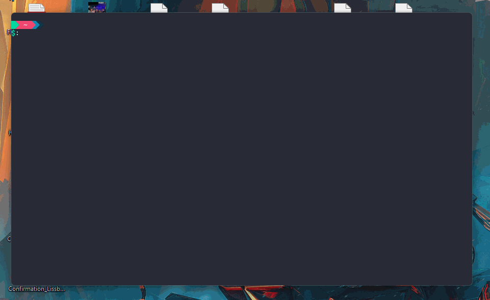

### How to get a output from CodePromise



#### Folderstructure

```
.
├── README.md
├── backend
│   ├── code.js
│   ├── conny.contract
│   ├── conny.json
│   ├── conny.wasm
│   ├── node_modules
│   ├── package-lock.json
│   └── package.json
└── contracts
    └── conny

4 directories, 7 files

```

`./backend` contains the nodejs application to upload the conny contract.
`./contracts/conny` contains the ink contract(alias flipper contract)

#### How to compile contract

1. Run `docker run -it -v /home/frank/codeBeast:/ink frankbevr/ink`
2. `cd /ink/contracts/conny`
3. `cargo check`
4. `cargo +nightly contract build`
5. `ls ./target/ink/`
6. There is the compile output. `.json` is the abi, `.wasm` is the wasm blob, `.contract` is a file which contains metadata/abi and wasm blob in one file.
7. If you change the contract you have to recopy the file from the /target folder to backend

#### How to run Code Promise

> ⚠️ Doesn't work in the Docker Container out of the box. To make it work, I have to change too many stuff in the Dockerfile.  
> 8. `cd /ink/backend/`  
> 9. `CTRL+p+d` create a new pan below downwards  
> 10. `substrate-contracts-node --dev`  
> 11. `CTRL+p+p+enter` switches pan to upwards  
> 12. `npm install`  
> 13. `node code.js`  
> 14. Now you should see the newly deployed contract Address

8. run `exit` and you are out of the docker container
9. run `cd ~/codeBeast/` cd `./backend`
10. run `node --version` above 16+ everything should be fine.
11. run `substrate-contracts-node --dev` and the substrate-contract-node starts, if not install run `cargo install contracts-node`
12. Open up a new Terminal or split the pan and navigate to `~/codeBeast/backend/`
13. run `node code.js`

#### How it works

15. `bat ./code.js`, minimalisitc comments should help to navigate this function.
